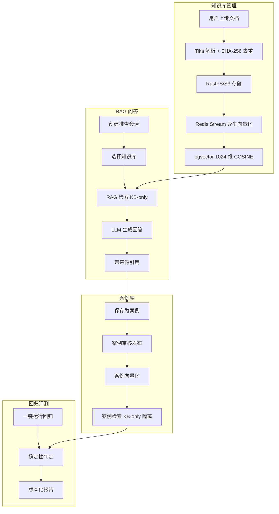

<div align="center">

**DevSupport** — 研发团队知识与故障排查平台

RAG 问答 + 案例库 + 回归评测

[](https://openjdk.org/)
[](https://spring.io/projects/spring-boot)
[](https://react.dev/)
[](https://www.typescriptlang.org/)
[](https://www.postgresql.org/)

</div>

---

## 项目介绍

DevSupport 是面向研发团队的**知识管理与故障排查平台**：把服务文档、部署手册、复盘记录、接口说明等上传为知识库，通过 RAG 检索增强问答获得带来源引用的回答，高质量回答可沉淀为案例，并通过回归评测持续跟踪检索质量。

**来源与改造关系**：本项目 fork 自上游 [Snailclimb/interview-guide](https://github.com/Snailclimb/interview-guide)（AI 面试平台）。DevSupport 复用了上游的**文档解析 / 向量化 / RAG 流式问答 / 多 Provider 管理 / PostgreSQL + pgvector 存储**等基础设施，把用户可见语义重定位为研发知识 & 故障排查；上游面试 / 简历 / 语音模块代码保留在后端但不作为 DevSupport 交付面。

---

## 系统架构



**完整链路**：
1. **文档上传** → 知识库管理 → 向量化（Redis Stream 异步）→ pgvector 存储
2. **创建排查会话** → RAG 检索（KB-only）→ LLM 生成回答（带来源引用）
3. **保存为案例** → 案例库审核发布 → 回归评测（KB-only 隔离）
4. **评测结果** → 版本化报告

---

## 技术栈

### 后端

| 技术 | 版本 | 说明 |
|------|------|------|
| Spring Boot | 4.1.0 | 应用框架 |
| Java | 25 | 开发语言（虚拟线程） |
| Spring AI | 2.0.0 | AI 集成框架 |
| PostgreSQL + pgvector | 14+ | 关系数据库 + 向量存储（1024 维 COSINE） |
| Redis + Redisson | 6+ / 4.0.0 | 缓存 + 消息队列（Stream） |
| RustFS / S3 | - | 对象存储 |
| Apache Tika | 2.9.2 | 文档解析 |
| iText 8 | 8.0.5 | PDF 导出 |
| Gradle | 9.6.1 | 构建工具 |

### 前端

| 技术 | 版本 | 说明 |
|------|------|------|
| React | 18.3 | UI 框架 |
| TypeScript | 5.6 | 开发语言 |
| Vite | 5.4 | 构建工具 |
| Tailwind CSS | 4 | 样式框架 |
| pnpm | 10.26 | 包管理器 |

---

## 快速开始

### 方式 A：Demo Profile（零付费，推荐新人体验）

```bash
# 1. 创建环境配置（POSTGRES_PASSWORD 为最小必需项，demo 模式不需要 AI API Key）
cp .env.example .env
# 编辑 .env，设置 POSTGRES_PASSWORD 为强密码

# 2. 启动依赖服务
docker compose -f docker-compose.dev.yml up -d

# 3. 启动后端（demo profile 使用确定性向量和模板响应）
./gradlew :app:bootRun --args='--spring.profiles.active=demo'

# 4. 启动前端
cd frontend && pnpm run dev
```

访问 http://localhost:5173 打开前端界面。

### 方式 B：完整部署（需要 API Key）

```bash
# 1. 复制环境变量模板
cp .env.example .env

# 2. 编辑 .env 填入 API Key
# AI_BAILIAN_API_KEY=your_dashscope_api_key
# APP_AI_CONFIG_ENCRYPTION_KEY=your_random_long_secret
# POSTGRES_PASSWORD=<必填>

# 3. 一键启动
docker compose up -d
```

| 服务 | 地址 | 说明 |
|------|------|------|
| 前端应用 | http://localhost | Nginx 反向代理 |
| 后端 API | http://localhost:8080 | RESTful API |
| 接口文档 | http://localhost:8080/swagger-ui.html | SpringDoc/Swagger UI |
| PostgreSQL | localhost:5432 | 数据库 + pgvector |
| Redis | localhost:6379 | 缓存与消息队列 |
| RustFS 控制台 | http://localhost:9001 | 对象存储管理 |

---

## Demo 演示路径（30 分钟跑通）

详细步骤参见 [docs/demo/README.md](./docs/demo/README.md)，核心流程：

1. **启动应用**（demo profile）
2. **访问前端** http://localhost:5173
3. **上传 5 个故障场景文档**到知识库
   - `01-db-connection-pool-exhaustion.md` — 数据库连接池耗尽
   - `02-redis-oom.md` — Redis 内存溢出
   - `03-s3-upload-timeout.md` — S3 上传超时
   - `04-ssl-certificate-expired.md` — SSL 证书过期
   - `05-jvm-off-heap-oom-kill.md` — JVM 堆外内存泄漏
4. **创建排查会话**，使用演示提问模板提问
5. **查看带来源引用的回答**
6. **将回答保存为案例**
7. **查看案例库和评测结果**

---

## 项目结构

```
app/src/main/java/interview/guide/
├── common/              # 通用能力（限流、AI 调用、异步模板、配置、异常、Result）
├── infrastructure/      # 技术基础设施（文件、导出、Redis、MapStruct）
├── modules/
│   ├── knowledgebase/   # 知识库管理 + RAG 问答
│   ├── caselibrary/     # 案例库
│   ├── evalregression/  # 回归评测
│   ├── resume/          # 简历模块（保留，未暴露入口）
│   └── llmprovider/     # LLM Provider 管理

frontend/src/            # React 前端
├── api/                 # Axios 集中
├── components/          # 公共组件
├── pages/               # 页面
├── types/               # 类型定义
└── utils/               # 工具

docs/demo/               # 演示故障场景文档
eval/datasets/           # 评测语料与冻结产物
```

---

## Demo 与真实 AI 能力的边界

| 特性 | Demo Profile | 完整部署（需 API Key） |
|------|--------------|------------------------|
| 向量化 | 确定性常量向量 | 真实 DashScope Embedding |
| LLM 回答 | 模板响应 | 真实 LLM 生成 |
| 适用场景 | 功能演示、开发测试 | 生产环境 |
| 费用 | 零付费 | 需付费 API Key |

**注意**：Demo Profile 不产生真实 AI 能力，仅用于功能验证和开发调试。真实语义检索质量需运行完整部署并配置 API Key。

---

## 已验证能力

- ✅ 真实 Flyway 迁移（16 个迁移脚本）
- ✅ 真实 Redis Stream（含重启恢复）
- ✅ 真实 S3 上传（RustFS 生产同款）
- ✅ 确定性回归管线（KB-only 隔离）
- ✅ Docker Compose 一键启动（bucket 自动初始化）
- ✅ Testcontainers 集成测试（pgvector/pgvector:pg16 + redis:7-alpine + rustfs/rustfs:latest）

---

## 未验证事项

- ⏳ 真实语义检索质量（需运行真实付费 embedding）
- ⏳ `docker-compose.yml` 全栈部署（使用 MinIO 非 RustFS，未实测）

---

## 开发命令

```bash
# 后端
./gradlew :app:compileJava
./gradlew :app:test --no-daemon
./gradlew :app:bootRun

# 前端
cd frontend && pnpm run dev
cd frontend && pnpm run build

# 依赖服务
docker compose -f docker-compose.dev.yml up -d
```

---

## 项目路线图

详见 [DEVSUPPORT_ROADMAP.md](./DEVSUPPORT_ROADMAP.md) — 产品定位、开发阶段、验收标准与 Agent 执行边界。

---

## 贡献

欢迎提交 Issue 和 Pull Request。改动前后请阅读 `PROJECT_PROGRESS.md`（跨会话任务进度事实源）与 `CHANGES.md`（每次改动记录），保持状态同步。

---

## 许可证

AGPL-3.0 License（继承自上游；只要通过网络提供服务，就必须向用户公开修改后的源码）
